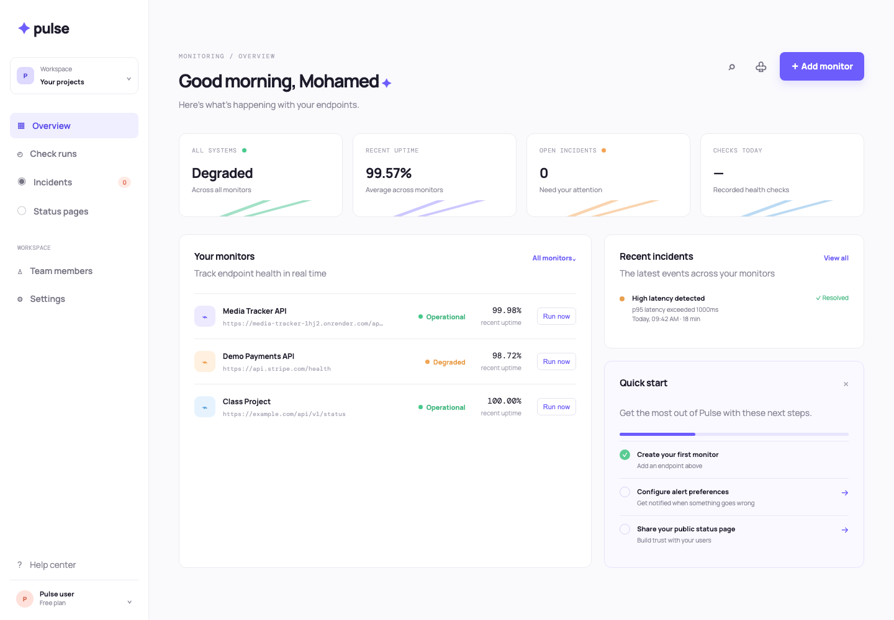
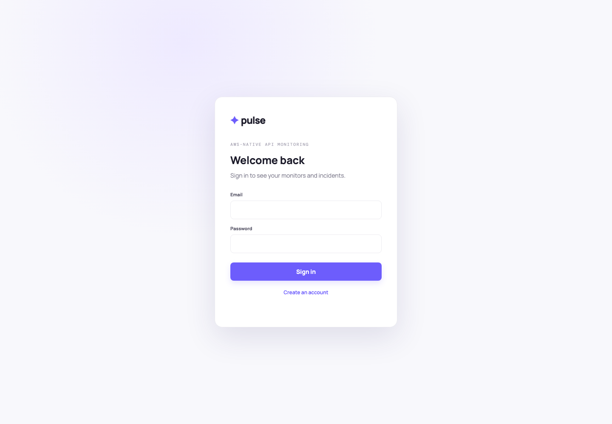
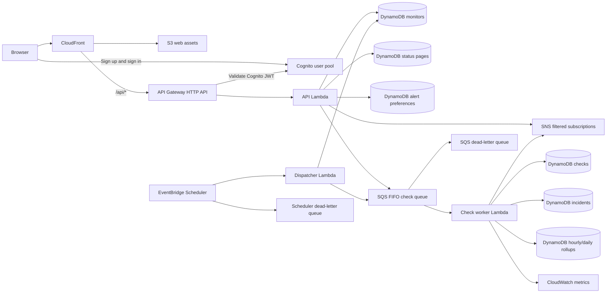

# Pulse API Monitor

Pulse is a developer-facing monitoring platform for scheduled HTTP health checks, latency tracking, response assertions, incident lifecycles, and recovery alerts.

Live development dashboard: <https://d1ir16za70xnod.cloudfront.net>

## Screenshots





The repository currently contains two working layers:

- A dependency-light local dashboard and API for product iteration.
- A synthesized AWS CDK stack with queue-based workers, persistence, authentication, scheduling, alerts, metrics, and cost controls.

## Architecture



## Implemented

- Monitor creation, search, status filtering, detail, editing, pause/resume, cascade deletion, and manual check queueing
- Dedicated, filterable monitor, check-run, and incident-history views on desktop and mobile
- Browser history-aware navigation, working workspace/account menus, and an in-app help center
- Configurable, auto-refreshing public status pages with selected services, live health, latency, open incidents, and recent recoveries
- Reliability comparisons with p50/p95 latency, failure rate, state-change counts, and transparent flakiness classification
- Persisted hourly and daily rollups for 24-hour, 7-day, and 30-day uptime, failure count, and average-latency analytics
- Per-account email alert preferences with SNS filters for incident-opened and incident-resolved events
- One-time maintenance windows that suppress checks and incident creation while showing maintenance publicly
- Custom public incident titles and updates without exposing internal failure diagnostics
- GET and HEAD health checks with status and timeout expectations
- `contains_text`, `json_path_exists`, and `json_path_equals` assertions
- DNS and IP checks that reject local, private, link-local, and reserved targets
- Two consecutive failures before an incident opens
- Automatic incident recovery on the next successful check
- FIFO processing per monitor with retries and a dead-letter queue
- Thirty-day check-history TTL
- CloudWatch Embedded Metric Format for latency and success metrics
- SNS notifications when incidents open and resolve
- Cognito JWT authorization for user-owned API data
- Private S3 dashboard hosting behind CloudFront origin access control
- Browser sign-up, email confirmation, sign-in, sign-out, password recovery, and session refresh through Cognito
- Authentication-first boot screen that prevents protected dashboard content from flashing before sign-in
- Optional forecasted monthly budget alert at 80% of $5
- Responsive dashboard with honest loading, empty, and error states
- Local adapter with the same monitor-management actions and seeded demonstration data

## Run locally

Requires Node.js 22 or later.

```bash
npm test
npm start
```

Open `http://localhost:3000`.

The local adapter stores demonstration data in `data.json`. It is intentionally separate from the AWS data plane so the product can be developed without cloud charges.

## Validate the AWS stack

```bash
npm --prefix infra install
npm --prefix infra test
npm run infra:build
npm run infra:synth
```

Synthesis is read-only with respect to AWS: it creates a CloudFormation template locally but does not provision resources.

Current validation includes 11 local domain tests and 8 infrastructure tests. They cover JSON/text assertions, private-network blocking, incident opening/recovery, reliability calculations, monitor, maintenance, alert-preference, incident-update, and status-page validation, resource counts, runtime/architecture selection, scheduling, hosting, authentication, and conditional budget creation. No percentage coverage claim is made yet because line coverage is not currently instrumented.

## Deploy to AWS

Use the non-root IAM user and `us-west-2`. Bootstrap and deployment create AWS resources, so review [the deployment runbook](docs/aws-deployment.md) before running them.

```bash
aws sts get-caller-identity
aws configure get region
cd infra
npx cdk bootstrap
npx cdk diff
npx cdk deploy --require-approval broadening
```

To include the optional $5 forecast budget email:

```bash
npx cdk deploy -c budgetEmail=you@example.com --require-approval broadening
```

Incident-alert emails are configured per user in Account & security. AWS sends a confirmation email before a saved subscription becomes active.

Run the disposable authenticated smoke test after deployment:

```bash
./scripts/aws-smoke-test.sh
```

See [the verified deployment state](docs/deployment-state.md) for the current environment and validation results.

## API routes

`GET /health`, `GET /api/health`, `GET /api/config`, and `GET /status/{slug}` are public. Account data and status-page management routes require a Cognito access token. The `/api/*` forms are used by the CloudFront-hosted dashboard; unprefixed aliases are retained for direct API testing.

| Method | Route | Purpose |
| --- | --- | --- |
| `GET` | `/monitors` | List the authenticated user's monitors |
| `POST` | `/monitors` | Create a monitor |
| `GET` | `/monitors/{monitorId}` | Get monitor configuration and state |
| `PATCH` | `/monitors/{monitorId}` | Update or pause a monitor |
| `DELETE` | `/monitors/{monitorId}` | Delete a monitor and its check/incident history |
| `POST` | `/monitors/{monitorId}/check` | Queue an immediate check |
| `GET` | `/monitors/{monitorId}/checks` | Return the latest 100 checks |
| `GET` | `/monitors/{monitorId}/incidents` | Return incident history for a monitor |
| `PATCH` | `/monitors/{monitorId}/incidents/{incidentId}` | Publish customer-safe incident text |
| `GET` | `/monitors/{monitorId}/analytics?window=24h\|7d\|30d` | Return persisted uptime and average-latency rollups |
| `GET` | `/incidents` | Return recent incidents across the account |
| `GET/PUT/DELETE` | `/alert-preferences` | Read, configure, or remove a filtered email subscription |
| `GET` | `/status-page` | Get the authenticated user's status-page configuration |
| `PUT` | `/status-page` | Create or update a status page |
| `DELETE` | `/status-page` | Delete a status page and disable its public link |
| `GET` | `/status/{slug}` | Return a published status page without authentication |

## Cost posture

The development stack uses pay-per-request DynamoDB, ARM Lambda functions, short log retention, no NAT Gateway, no provisioned database, and removal policies intended for disposable development environments. Actual charges depend on usage and AWS account eligibility. Destroy the stack when it is not needed:

```bash
cd infra
npx cdk destroy
```

## Current boundary

The development backend is provisioned in `us-west-2`. It includes CloudFront/S3 hosting, Cognito authentication, monitor and incident lifecycles, public status pages, customer-safe incident updates, maintenance windows, filtered per-account SNS alerts, recent p50/p95 reliability analysis, and persisted longer-window uptime/average-latency rollups. Percentiles remain based on the latest 100 raw checks; the persisted buckets intentionally store aggregate counts and latency sums rather than long-window percentile sketches.
